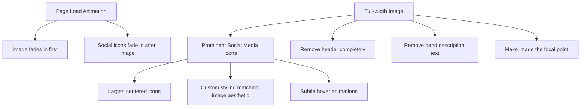

# Final Website Plan for "The Calm Blue Sea"

## Overview
A minimalist landing page featuring your band logo image as the focal point with larger, prominent social media icons centered below it, and a gentle fade-in animation on page load.

## Color Palette (Extracted from Image)
- Background: Muted teal/blue-gray gradient (#607d8b to #37474f)
- Text/Icons: Off-white/cream (#f5f5dc)
- Accents: Darker blue (#2c3e50) and light blue highlight (#8ca9c0)

## Layout & Animation

## Implementation Details

### HTML Changes
- Remove header and band description sections
- Keep only the image and social media links
- Structure for centered, prominent social icons

### CSS Updates
- Update color scheme to match image palette
- Create custom styling for larger social icons:
  - Larger size (approximately 60-70px)
  - Off-white/cream color matching the text in the image
  - Circular backgrounds with subtle gradient
  - Increased spacing between icons
- Add elegant hover effects for icons:
  - Gentle scaling
  - Subtle glow effect similar to the textured look in the image
  - Smooth transitions

### Animation Implementation
- Use CSS animations for the fade-in effect:
  - Image starts with opacity: 0 and transitions to opacity: 1 over 1.5 seconds
  - Social icons start with opacity: 0 and transition to opacity: 1 with a 0.5 second delay after the image
  - Smooth easing functions for natural-feeling animations

### Responsive Considerations
- Image scales appropriately on all devices
- Social icons adjust size on smaller screens
- Maintain proper spacing across all viewport sizes
- Animations work consistently across devices

## Next Steps
1. Save the band logo image to the images directory
2. Update the HTML structure to remove unnecessary elements
3. Modify the CSS to implement the new color scheme and styling
4. Add animation effects
5. Test on multiple devices and screen sizes