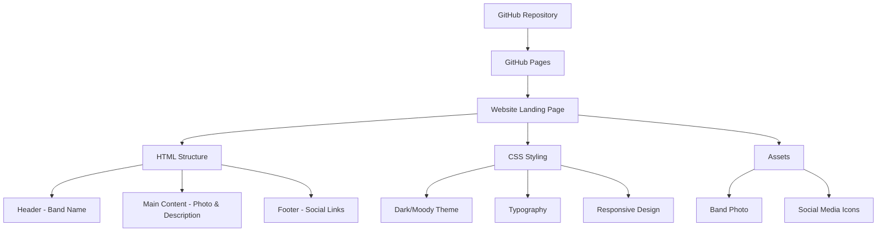
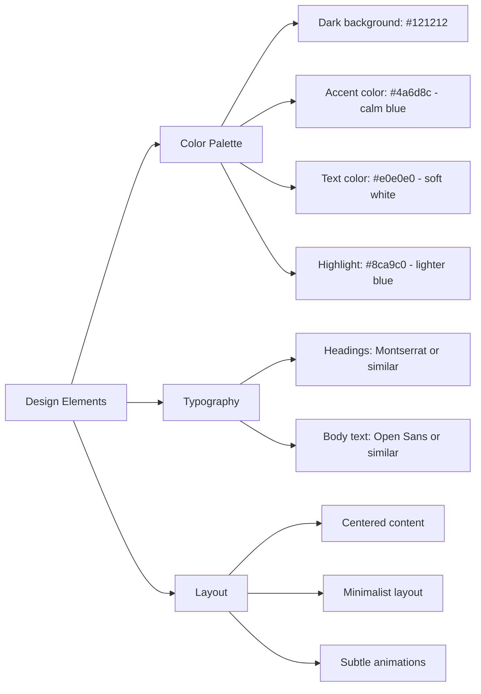

# Website Plan for "The Calm Blue Sea"

## Overview
We'll create a simple, elegant landing page with a dark/moody yet peaceful aesthetic that reflects your post-rock sound. The site will be hosted on GitHub Pages, which provides free hosting directly from a GitHub repository.

## Technical Architecture

## Implementation Plan

### 1. GitHub Pages Setup
1. Create a GitHub account (if you don't have one)
2. Create a new repository named `thecalmbluesea.github.io` (or `username.github.io` if you prefer)
3. Enable GitHub Pages in the repository settings
4. Set up a basic project structure locally

### 2. Website Structure
We'll keep the structure simple with just a few files:
- `index.html` - Main landing page
- `css/style.css` - Styling
- `images/` - Folder for band photo and any other images
- `README.md` - Documentation for the repository

### 3. Design Elements

The color palette is inspired by the band name "The Calm Blue Sea" with dark backgrounds and blue accents that create a moody yet peaceful atmosphere.

### 4. Content Implementation
1. **Header**: Simple display of the band name with subtle animation
2. **Main Content**: 
   - Featured band photo (full-width or centered)
   - Brief band description (2-3 sentences about your music)
3. **Footer**:
   - Social media links with recognizable icons for Instagram, Bandcamp, Spotify, Facebook, and Twitter
   - Each icon will link to your respective social media pages

### 5. Responsive Design
The site will be fully responsive, looking good on:
- Desktop computers
- Tablets
- Mobile phones

### 6. Testing & Deployment
1. Test the website locally
2. Push changes to GitHub
3. GitHub Pages will automatically deploy your site
4. Verify all links and display on different devices

## Timeline
1. GitHub setup: 30 minutes
2. Basic HTML structure: 1 hour
3. CSS styling: 2-3 hours
4. Testing and refinement: 1 hour
5. Deployment: 30 minutes

Total estimated time: 5-6 hours

## Future Enhancements (Optional)
- Add a music player
- Include a mailing list signup
- Add an events/tour section
- Blog or news section